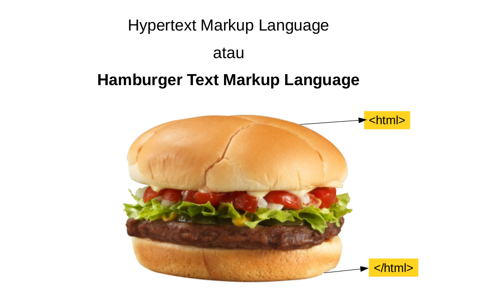
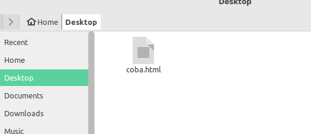
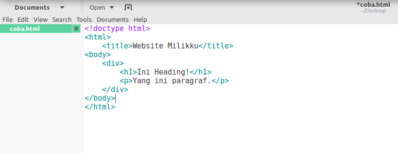

# Doscom University Web Programming
Selamat datang di Doscom University kelas Web Programming. Halaman ini ditujukan sebagai bekal untuk kita belajar sebelum pertemuan di kelas nanti.

Selamat Belajar :wink::wink:

## HTML
Singkatan dari Hypertext Markup Language, HTML adalah salah satu markup language yang menjadi dasar pembangunan halaman web. Bukan bahasa pemrograman yaa

HTML dibuat untuk merepresentasikan tampilan sebuah halaman web. Bukan sebagai bahasa pemrograman, HTML ini digunakan untuk menandai bagian-bagian halaman web, mana yang judul, mana yang sub judul, yang paragraf, baris, tabel, dan sebagainya.

Umumnya halaman web dibangun atas tiga unsur:
- HTML sebagai struktur tampilan: header, paragraf, tombol, dll.
- CSS memberi gaya dalam mempresentasikan halaman web (style): warna, ukuran, tata letak, dll.
- JavaScript, yang memiliki fungsional karena merupakan bahasa pemrograman.


Belajar HTML dan CSS bukan berarti kita sedang belajar pemrograman. Ya karena memang bukan bahasa pemrograman :smile::smile: . Namun kita dapat membuat halaman web dengan ini. Halaman web seperti ini biasa disebut web statis

Kenapa HTML Bukan Bahasa Pemrograman Bisa di Simak Disini 

https://makinrajin.com/html-bukan-bahasa-pemrograman/


	#### Membuat file html sederhana
	Untuk membuat file html anda cukup membuat file dengan menggunakan text editor. Kemudian simpan file tersebut dengan nama yang anda kehendaki dengan ekstensi `.html`. Selamat anda sudah dapat membuat file html \(^0^)/

	#### Memahami struktur HTML
	HTML sendiri memiliki struktur hirarkiah sebagai berikut :
	```html
	<html>
	  <head></head>
	  <body></body>
	</html>
	```
	Jadi untuk struktur HTML harus memiliki tag html yang didalamnya terdapat tag head dan body (baik tag pembuka dan tag penutup)

	#### Menggunakan komentar HTML
	Untuk memberikan komentar anda dapat menyisipkan tag `<!-- -->` berikut pada konten yang dikehendaki. Sebagai contoh :
	```
	  <!-- konten yang dikehendaki -->
	```
	atau jika anda menggunakan text editor atom anda dapat menekan `CTRL + /` pada baris yang akan anda komentar.

	#### Menulis Judul menggunakan Heading
	Untuk menulis judul anda dapat memilih menggunakan tag `h1`, `h2` sampai `h6`. Besar kecilnya heading mempengaruhi besar kecilnya ukuran judul. Jadi semakin besar heading semakin kecil ukuran judulnya dan sebaliknya.
	Sebagai contoh :
	```html
	<h1>Judul dengan h1</h1>
	```
	# Judul dengan h1
	```html
	<h2>Judul dengan h2</h2>
	```
	## Judul dengan h2
	```html
	<h6>Judul dengan h6</h6>
	```
	## Judul dengan h6

	#### Menulis kalimat atau paragraf menggunakan Paragraph
	Untuk menulis kalimat anda dapat meletakkanya di dalam tag `p`. Sebagai contoh :
	```html
	<p>
	  Ini kalimat pertama. Ini kalimat kedua. Ini kalimat ketiga. Ini kalimat keempat. Ini kalimat kelima. Ini kalimat keenam. Ini kalimat ketujuh. Ini kalimat kedelapan. Ini kalimat kesembilan. Ini kalimat kesepuluh.
	</p>
	```

	#### Mengganti baris menggunakan Line Breaker
	Untuk mengganti baris anda dapat menggunakan tag `br`. Sebagai contoh :
	```html
	<p>
	  Ini baris pertama.<br>
	  Ini baris kedua.<br>
	  Ini baris ketiga.<br>
	  Ini baris keempat.<br>
	  Ini baris kelima.<br>
	</p>
	```

Cara penulisan html kurang lebihnya seperti ini:

```html
<!doctype html>
<html>
    <title>Website Milikku</title>
<body>
    <div>
        <h1>Ini Heading!</h1>
        <p>Yang ini paragraf.</p>
    </div>
</body>
</html>
```

Jika kita perhatikan teks di atas memiliki sesuatu yang dikurung dengan kurung siku `<>`. Ini disebut dengan tag html.
Tag html memiliki tag pembuka `<tag>` dan tag penutup `</tag>` (ada beberapa tag yang tidak perlu tag penutup). Format penulisannya seperti ~~krabby patty~~ burger / sandwich.

Karena itu HTML juga disebut Hamburger Text Markup Language.



Dalam dunia web, dokumen HTML yang benar memiliki dua bagian utama:
- Head dan meta data
- Body (badan HTML, bagian yang terlihat di halaman web)

Cobalah buat file baru dengan nama coba.html



Kemudian buka file coba.html itu dengan teks editor (gedit, notepad atau lainnya) dan copykan code html di atas tadi ke file ini



Simpan file .html ini lalu buka dengan browser.

Selamat mencoba :blush::blush:

---

---


### Referensi dan tambahan mengenai HTML

:bulb: [SoloLearn Course HTML](https://www.sololearn.com/Course/HTML/)
:bulb: [HTML by hacktiv8](https://github.com/hacktiv8/phase-0-activities/blob/master/modules/html5-basics.md)

---

---
credits:
- [hacktiv8](https://github.com/hacktiv8)
- [doscom](http://doscom.org/)
