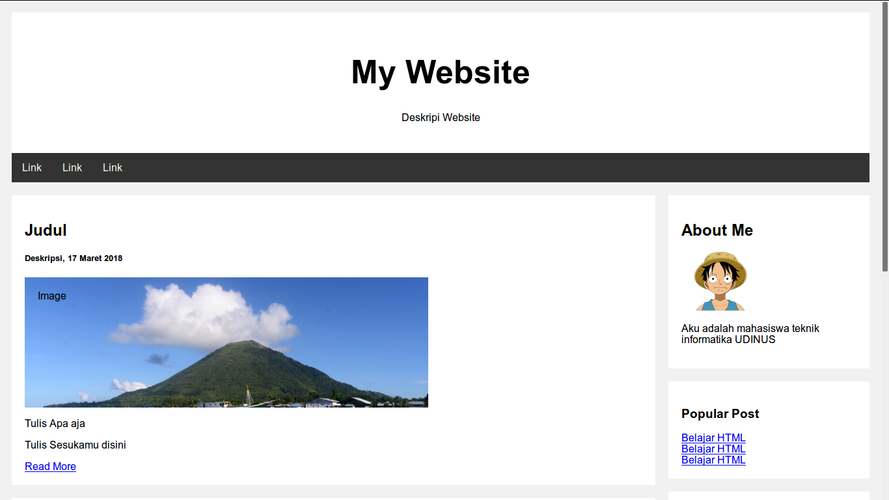

## Review Materi Pertemuan Pertama Doscom University

### HTML
#### Membuat file html sederhana
Untuk membuat file html anda cukup membuat file dengan menggunakan text editor. Kemudian simpan file tersebut dengan nama yang anda kehendaki dengan ekstensi `.html`. Selamat anda sudah dapat membuat file html \(^0^)/

#### Memahami struktur HTML
HTML sendiri memiliki struktur hirarkiah sebagai berikut :
```html
<html>
  <head></head>
  <body></body>
</html>
```
Jadi untuk struktur HTML harus memiliki tag html yang didalamnya terdapat tag head dan body (baik tag pembuka dan tag penutup)

#### Menggunakan komentar HTML
Untuk memberikan komentar anda dapat menyisipkan tag `<!-- -->` berikut pada konten yang dikehendaki. Sebagai contoh :
```
  <!-- konten yang dikehendaki -->
```
atau jika anda menggunakan text editor atom anda dapat menekan `CTRL + /` pada baris yang akan anda komentar.

#### Menulis Judul menggunakan Heading
Untuk menulis judul anda dapat memilih menggunakan tag `h1`, `h2` sampai `h6`. Besar kecilnya heading mempengaruhi besar kecilnya ukuran judul. Jadi semakin besar heading semakin kecil ukuran judulnya dan sebaliknya.
Sebagai contoh :
```html
<h1>Judul dengan h1</h1>
```
# Judul dengan h1
```html
<h2>Judul dengan h2</h2>
```
## Judul dengan h2
```html
<h6>Judul dengan h6</h6>
```
## Judul dengan h6

#### Menulis kalimat atau paragraf menggunakan Paragraph
Untuk menulis kalimat anda dapat meletakkanya di dalam tag `p`. Sebagai contoh :
```html
<p>
  Ini kalimat pertama. Ini kalimat kedua. Ini kalimat ketiga. Ini kalimat keempat. Ini kalimat kelima. Ini kalimat keenam. Ini kalimat ketujuh. Ini kalimat kedelapan. Ini kalimat kesembilan. Ini kalimat kesepuluh.
</p>
```

#### Mengganti baris menggunakan Line Breaker
Untuk mengganti baris anda dapat menggunakan tag `br`. Sebagai contoh :
```html
<p>
  Ini baris pertama.<br>
  Ini baris kedua.<br>
  Ini baris ketiga.<br>
  Ini baris keempat.<br>
  Ini baris kelima.<br>
</p>
```

#### Mengelompokkan konten menggunakan Div
Dalam HTML untuk setiap konten yang ditulis biasanya dikelompokkan kedalam satu tempat di dalam tag `div`. Div ini akan mempermudah anda dalam melakukan kostumisasi tiap kontenya. Sebagi contoh :
```html
<div>
  <h1>Ini judul konten</h1>
  <p>
    /*Ini isi konten.*/
  </p>
</div>
```

#### Menambahkan gambar
Untuk Menambahkan gambar pada laman web, anda dapat menggunakan tag `img`. Tag tersebut sendiri mengharuskan kita untuk memasukkan parameter berupa letak file tersebut berada (menggunakan parameter `src`). Sebagai contoh :
```html

```
Berdasarkan letak filenya ada beberapa cara untuk menambahkan gambar yaitu :
- Memasukan gambar dalam direktori yang sama
  Apabila gambar anda berada di satu direktori yang sama (semisal /home/dosom/Document) anda dapat menggunakan
  ```html
  
  ```
- Memasukkan gambar di direktori yang berbeda
  Apabila gambar anda berada di satu direktori yang berbeda (semisal file html ada berada di /home/dosom/Document dan gambar ada berada di /home/doscom/Document/Gambar) anda dapat menggunakan
  ```html
  
  ```
- Gambar online
  Apabila anda ingin menambahkan gambar yang berada di internet anda dapat menggunakan
  ```html
  
  ```

#### Menggunakan Link
Untuk Menambahkan link pada laman web, anda dapat menggunakan tag `a`. Tag tersebut sendiri mengharuskan kita untuk memasukkan parameter berupa letak file tersebut berada (menggunakan parameter `href`). Sebagai contoh :
```html
<a href=""></a>
```
Berdasarkan kegunaanya ada beberapa cara untuk menggunakan link yaitu :
- Menggunakan link untuk berpindah ke posisi tertentu
  Apabila anda ingin berpindah ke posisi tertentu semisal anda berada di bagian laman paling bawah dan ingin naik ke laman paling atas. Pertama anda harus menambahkan id pada indikator yang menunjukkan bahwa dia berada di laman paling atas (bisa judul dan sebagainya). Contoh ini menggunakan judul :
  ```html
  <h1 id="PalingAtas">Ini Judul Paling Atas</h1>
  <p>
    Ini paragraf yang panjang.
  </p>
  <a href="#PalingAtas">Link ke laman paling atas</a>
  ```
- Menggunakan link untuk berpindah ke file html lain
  Untuk berpindah ke file html lain anda dapat menggunkan
  ```html
  <a href="fileHtmlYangAndaInginkan.html">Link ke laman html yang anda inginkan</a>
  ```
- Menggunakan link untuk menuju URL tertentu
  Untuk menuju URL tertentu anda dapat menggunkan
  ```html
  <a href="http://www.urlAnda.com">Link ke URL anda</a>
  ```

- Memasukan gambar dalam direktori yang sama
  Apabila gambar anda berada di satu direktori yang sama (semisal /home/dosom/Document) anda dapat menggunakan
  ```html
  
  ```
- Memasukkan gambar di direktori yang berbeda
  Apabila gambar anda berada di satu direktori yang berbeda (semisal file html ada berada di /home/dosom/Document dan gambar ada berada di /home/doscom/Document/Gambar) anda dapat menggunakan
  ```html
  
  ```
- Gambar online
  Apabila anda ingin menambahkan gambar yang berada di internet anda dapat menggunakan
  ```html
  
  ```


### CSS
#### Menambahkan CSS ke dalam HTML
Untuk dapat menambahkan CSS ke dalam HTML ada beberapa cara yaitu :
- Menulisnya di dalam tag menggunakan argumen `style`
  ```html
  <p style="<--! isi css disini -->">

  </p>
  ```
  Sebagai contoh :
  ```html
  <p style="color: blue; margin: auto">
    Ini adalah kalimat yang akan di custom menggunakan css.
  </p>
  <p>
    Ini adalah kalimat yang tidak di custom menggunakan css.
  </p>
  ```
  Pada contoh tersebut kita hanya menggunakan css pada tag p bagian atas. Sehingga yang mengalami perubahan hanya konten bagian atas.
- Menggunakan tag style (internal css)
  ```html
  <body>
    <style>
      /*isi css di sini*/
    </style>  
  </body>
  ```
  Sebagai contoh :
  ```html
  <body>
    <style>
      p{
        color: blue;
        margin: auto;
      }
    </style>  
  </body>
  Pada contoh tersebut kita menggunakan css pada seluruh tag p pada file html yang bersangkutan. Sehingga seluruh content yang menggunakan tag p akan mengalami kostumisasi.
- Export File (eksternal css)
  Untuk mengexport file css pertama anda harus mempunyai file css. Pastikan file css anda berada pada direktori yang sama atau beberapa level lebih tinggi dengan file html anda. Hal ini sebenarnya digunakan untuk mempermudah dalam memasukkan path file css anda.
  Kemudian isi file css anda dengan coding yang dikehendaki.
  ```css
    p{
      color: blue;
      margin: auto;
    }
  ```
  Kemudian export file css anda ke dalam HTML menggunakan tag `link`. Dan masukkan path file css anda pada argumen `href`. Jangan lupa menambahkan argumen `rel` dengan value `stylesheet`.
  ```html
  <head>
    <link rel="stylesheet" href="urlCssAnda.css">
  </head>
  ```
  Tag link digunakan untuk mengexport css dengan nama urlCssAnda.css.


#### Kostumisasi css pada konten tertentu
Pada beberapa contoh diatas kita telah belajar menggunakan css pada tag HTML pada konten yang universal. Sekarang kita akan coba untuk mengkostumisasi konten tertentu.
##### Menggunakan argumen id
Argumen id ini nantinya akan anda gunakan untuk mendandai konten yang akan anda kostumisasi.
```html
<p id="namaId">
  Kalimat Pertama <br>
  Kalimat Kedua <br>
  Kalimat Ketiga <br>
</p>
```
Berikut cara menggunakan css-nya.
```css
#namaId{
  color: blue;
  margin: auto;
}
```
##### Menggunakan argumen class
Argumen class ini nantinya akan anda gunakan untuk mendandai konten yang akan anda kostumisasi. Tetapi ada sedikit perbedaan antara menggunakan argumen class ini pada tag div dan tag selain div.
Berikut contoh yang menggunakan tag div.
```html
<div class="namaClass">
  Kalimat Pertama <br>
  Kalimat Kedua <br>
  Kalimat Ketiga <br>
</p>
```
Berikut cara menggunakan css pada tag div.
```css
.namaClass{
  color: blue;
  margin: auto;
}
```
Berikut contoh yang menggunakan tag selain div.
```html
<p class="namaClass">
  Kalimat Pertama <br>
  Kalimat Kedua <br>
  Kalimat Ketiga <br>
</p>
```
Berikut cara menggunakan css pada tag div.
```css
p.namaClass{
  color: blue;
  margin: auto;
}
```
#### Macam - macam Kostumisasi css
- Mengganti warna tulisan
  Untuk mengganti warna tulisan anda dapat menambahkan warna yang anda kehedaki(dalam bahasa inggris) ke dalam parameter. Sebagai contoh :
  ```css
  .namaClass{
    color: blue;
  }
  ```
  Atau anda dapat menggunakan kode warna. Untuk kode warna yang dikehendaki anda dapat cari pada website http://. Sebagai contoh :
  ```css
  .namaClass{
    color: #FF5319
  }
  ```
- Mengganti ukuran tulisan
  Untuk mengganti ukuran tulisan cukup menambahkan ukuran yang dikehendaki menggunakan pixel(px).
  ```css
  .namaClass{
    font-size: 30px;
  }
  ```
- Menambahkan margin
  Ada beberapa cara untuk menambah margin di css. Ragamnya berdasarkan seberapa banyak parameter yang diinputan pada margin.
  Untuk margin yang menerima 1 inputan berarti dia melakukan kostumisasi margin di seluruh sisi pada konten bersangkutan (atas, bawah, kiri dan kanan).
  ```css
  .namaClass{
    margin: auto;
  }
  ```
  Untuk margin yang menerima 2 inputan berarti dia melakukan kostumisasi margin di bagian atas-bawah dan kiri-kanan.
  ```css
  .namaClass{
    margin: auto 1px;
  }
  ```
  Untuk margin yang menerima 4 inputan berarti dia melakukan kostumisasi margin di seluruh sisi pada konten bersangkutan (atas, bawah, kiri dan kanan).
  ```css
  .namaClass{
    margin: 20% 40px 10% 30px;
  }
  ```
  Jarak margin sendiri dapat didefinisikan dengan pixel(px) dan persentase(%).
- Mengatur perataan
  ```css
  .namaClass{
    text-align: 20% 40px 10% 30px;
  }
  ```
- Mengubah warna background
  ```css
  .namaClass{
    text-align: center;
  }
  ```
- Mengatur lebar konten
  ```css
  .namaClass{
    width: 70%;
  }
  ```
- Mengatur tinggi konten
  ```css
  .namaClass{
    height: 70%;
  }
  ```
- Mengatur indentasi kedalam
  ```css
  .namaClass{
    padding: 70%;
  }
  ```
- Mengatur warna border
  ```css
  .namaClass{
    border-color: #00B289;
  }
  ```
- Mengatur style border
  ```css
  .namaClass{
    border-style: solid;
  }
  ```
- Mengatur lebar border
  ```css
  .namaClass{
    border-width: solid;
  }
  ```

---

### Layouting




- box-sizing adalah css property yang digunakan untuk merubah kalkulasi dalam mengukur lebar element. Fitur ini cukup berguna karena sedikit menghilangkan pusing yang biasa timbul ketika kita sedang membuat layout web. Dimana biasanya kita menentukan lebar layout yang kita inginkan terlebih dahulu, setelah itu menentukan lebar sidebar dan conten web

 ```css
  .*{
    box-sizing:border-box;

  }
  ```

- Mengatur CSS pada body

  ```css
    body {
    font-family: Arial;
    padding: 10px;
    background: #f1f1f1;
}
 ```

  - Mengatur CSS Pada Header 
  ```css
.header {
    padding: 30px;
    text-align: center;
    background: white;
}

.header h1 {
    font-size: 50px;
}

 ```

 - Mengatur Style Pada Navigation Bar
```css
.topnav {
    overflow: hidden;
    background-color: #333;
}

.topnav a {
    float: left;
    display: block;
    color: #f2f2f2;
    text-align: center;
    padding: 14px 16px;
    text-decoration: none;
}

.topnav a:hover {
    background-color: #ddd;
    color: black;
}

```


---


---
## Tugas

- Jika Sudah Paham , Coba kalian edit web kalian semenarik mungkin dan Tambahkan Puisi  :wink::wink:
- Kemuadia Upload Ke Repository Github Yang kaling Bikin Tadi.

---

---
## Referensi dan Tambahan
- :bulb: [Sololearn course CSS](https://www.sololearn.com/Course/CSS/)
- :bulb: [Tutorial dan contekan lengkap HTML dan CSS di w3schools](https://www.w3schools.com/css/)

---

## Dasar Dasar CLI

## Perintah Dasar Linux
Untuk berselancar di Linux selain menggunakan Graphical User Interface(GUI) anda juga dapat menggunakan terminal. Untuk membuka terminal dapat dilihat di whisker, atau ketik `CTRL + ALT + T`, atau pada tealinux bisa dengan `F12` untuk menggunakan dropdown terminal.
Ada beberapa perintah dasar dalam terminal, yang paling banyak digunakan yaitu :
- Melihat file dan folder di direktori
  ```bash
  $ ls
  ```
- Berpindah direktori
  ```bash
  $ cd <nama folder>
  ```
- Berpindah ke direktori satu level di atasnya
  ```bash
  $ cd ..
  ```
- Membuat empty file
  ```bash
  $ touch <nama file>
  ```
# Github
Github merupakan salah satu sarana developer untuk berkolaborasi dalam membangun software.
Github memiliki unsur sosial, dimana orang-orang dapat membagikan code miliknya untuk dilihat orang lain dan juga melihat code yang orang lain bagikan, bahkan dapat berkontribusi di code(proyek) itu.
Ini menjadikan github sebagai platform terpopuler untuk membagikan proyek opensource dan menjadi tempat komunitas bergotong-royong mengembangkan proyek opensource.
Udah gak jaman lagi programmer itu orang yang sendirian dan gak punya temen brader :wink:.
Bahkan modern ini, profil GitHub dapat menggantikan resume/CV untuk melamar pekerjaan!


## Menggunakan Git
Git merupakan version control system. Deksripsi dan cara menggunakan dapat dilihat di https://git-scm.com/
Ada beberapa perintah dasar git dalam terminal, yang paling banyak digunakan yaitu :
- Mengisi identitas git di perangkat anda
  ```bash
  $ git config --global user.name "usernameanda"
  $ git config --global user.email "emailanda@emailanda.com"
  ```
- Menginisialisasi git pada project
  ```bash
  $ git init
  ```
- Menambah record git
  ```bash
  $ git add <nama file> ///menambah file tertentu
  $ git add . ///menambah semua filenyae
  ```
- Mengcommit git
  ```bash
  $ git commit -m "pesan anda"
  ```
- Melihat log atau daftar commit
  ```bash
    $ git log
  ```
- Kembali pada commit sebelumnya
  ```bash
    $ git checkout <commit yang ingin dituju>
  ```


## Hosting Project ke Github
- Menambahkan repo remote
  Repo remote adalah repo yang ada di luar komputer kita. Dalam contoh ini adalah repo di github
  ```bash
  $ git remote add <nama-remote> <link-repo-remote>
  ```
  Contoh :
  ```bash
  $ git remote add origin https://github.com/DOSCOM/doscom-university-2017.git
  ```
  Untuk nama git dapat anda lihat di repository github anda pada bagian `Clone or download`

- Menyimpan proyek ke repo remote
  ```bash
  $ git push <nama-remote> <nama-branch>
  ```
  secara default branch yang dimiliki adalah `master`.
  Contoh :
  ```bash
  $ git push origin master
  ```

---


## Menggunakan Bootstrap
Bootstrap merupakan CSS Framework. Untuk dapat menggunakan bootstrap dapat anda lihat di http://getbootstrap.com.
Untuk memasang bootstrap pada project ikuti langkah berikut
- Download bootstrap di http://getbootstrap.com/getting-started/#download
- Ekstrak archive yang telah selesai di download lalu copy ke project anda.
- Import bootstrap.min.css ke html anda

---

## Referensi dan Tambahan
- :bulb: [Basic git dan github oleh hacktiv8](https://github.com/hacktiv8/phase-0-activities/blob/master/modules/git-github-basics.md)
- :bulb: [Tutorial interaktif Git dan Github oleh codesaya.com](https://codesaya.com/git/)

---


---
credits:
- [Sololearn](https://www.sololearn.com/)
- [w3schools](https://www.w3schools.com/)
- [doscom](http://doscom.org/)
